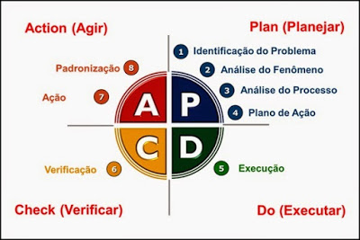

# Indexação de Vídeos

Aplicando efetivamente na prática a mentalidade de aprendizagem continuada (#livelonglearning).

Indexação de vídeos é uma estratégia para se aplicar técnicas de aprendizagem acelerada ([técnica revisão espaçada](https://youtu.be/XG0CAM_VYdE?si=-YqvN01n5A44NIGC)). Onde se corta um vídeo de orientações técnicas. Relacionando um momento do vídeo com um Tema (uma palavra-chave) onde se explica um conceito ou técnica de codificação.

_**IMPORTANTE**_: Já sabemos que existem ferramentas de Inteligências Artificiais que realizam a transcrição (vídeo para texto)! Mas o objetivo em priorizarmos e fazermos manualmente é realmente ter contato com o conteúdo e realmente absorver o conhecimento e com isso em mente criar os planos de ação necessários para colocar em prática e elaborar em projetos prova de conceito - POC.

E depois se relacionar a indexação com um questionário de contexto onde se busca associar ou relacionar os conceitos com um plano de ação operaiconal de trabalho. E com isso ter condição de criar scritps de automação ou mesmo aplicar o PDCA nas rotinas de trabalho já estabelacidas!

E **o objetivo é fortalecer a fixação do conceito e o seu uso prátino no projeto**! Criando uma forte relação entre os contextos / conceitos formando uma rede neural profunda e com uso realmente prático (empirismo) no dia a dia do trabalho operacioal!! E efetivametne agregar valor na equipe onde estamos atuando!

## Indexações Realizadas

Até o momento, aplicáveis ao presente projeto, temos as seguintes indexações.

### Status Totalmente Indexadas

* [VIDEO LONGO 071518 – 03.04.02.01.17.06 – 1 How to pass Exam 1Z0-811 | Java Oracle Certified Foundations Associate in 20 hours | Part1 – Questões](../../docs/indexacoes/VIDEO%20LONGO%20071518%20–%2003.04.02.01.17.06%20–%201%20How%20to%20pass%20Exam%201Z0-811%20|%20Java%20Oracle%20Certified%20Foundations%20Associate%20in%2020%20hours%20|%20Part1%20–%20Questões.pdf). Vídeo longo totalmente indexada e relacionada com os questionários de contextos!

* [VIDEO LONGO 074048 – 03.04.02.01.17.06 – 2 How to pass Exam 1Z0-811 | Java Oracle Certified Foundations Associate in 20 hours | Part 2 – Questões](../../docs/indexacoes/VIDEO%20LONGO%20074048%20–%2003.04.02.01.17.06%20–%202%20How%20to%20pass%20Exam%201Z0-811%20|%20Java%20Oracle%20Certified%20Foundations%20Associate%20in%2020%20hours%20|%20Part%202%20–%20Questões.pdf). Vídeo longo totalmente indexada e relacionada com os questionários de contextos!

* [VIDEO LONGO – 061942 – 03.04.02.01.17.06 – 3 How to pass Exam 1Z0-811 | Java Oracle Certified Foundations Associate in 20 hours | Part 3 – Questões](../..docs/indexacoes/VIDEO%20LONGO%20–%20061942%20–%2003.04.02.01.17.06%20–%203%20How%20to%20pass%20Exam%201Z0-811%20|%20Java%20Oracle%20Certified%20Foundations%20Associate%20in%2020%20hours%20|%20Part%203%20–%20Questões.pdf). Playlist totalmente indexada e relacionada com os questionários de contextos!

* [PLAYLIST 19 VIDEOS – 03.04.07.18.06 – Curso Multithread, Paralelismo e Concorrência com Java – RinaldoDev – Questões](PLAYLIST%2019%20VIDEOS%20–%2003.04.07.18.06%20–%20Curso%20Multithread,%20Paralelismo%20e%20Concorrência%20com%20Java%20–%20RinaldoDev%20–%20Questões.pdf). Playlist totalmente indexada e relacionada com os questionários de contextos!

### Status Parcialmente Idexadas

* [TRABALHO EM PROGRESSO](). Indexação incompleta! Trabalho em progresso e sempre revisitando para atualização dos conceitos para aplicar a técnica de revisão espaçada!

---

### Mentalidade PDCA

Tendo em mente que sempre buscamos melhorar o protocolo de trabalho operacional do dia a dia usando empirismo (colocar realmente em prática os conhecimentos abstratos).

**NOTA**: Não se trata de ficar ditando regras no trabalho da equipe, mas sim melhorar o [meu operacional pessoal de trabalho](#da-analise-exploratoria) e com isso agregar valor melhorando a perfomance:

---

---
 

