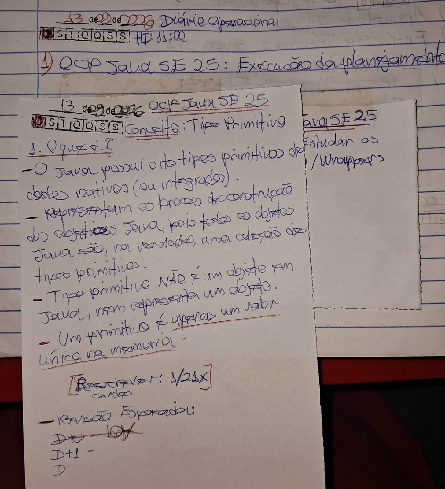

# Técnica Feynman 

Tendo em mente o vídeo [Como APRENDER QUALQUER COISA de maneira INTELIGENTE | A Técnica Feynman](https://youtu.be/CN_SCpGuJ_w?si=7eqvv5fpdCkjXVdz)! 

Aplicando o protocolo Feynman de 60 minutos especificamente para o CONCEITO: Primitivos / Wrappers! E usar os áudios e cards para aplicar a [técnica revisão espaçada](https://youtu.be/XG0CAM_VYdE?si=-YqvN01n5A44NIGC).


## Escolha o Assunto (0-2 min)

CONCEITO: Primitivos / Wrappers

## Escrever à Mão (2-25 min)

Numa folha de papel (card), procure responde as seguintes perguntas, escreva: 

```
O que é?
Como funciona?
Por que funciona?
Quando usar?
Quando NÃO usar?
Qual pegadinha?

```

E tire uma foto de evidência e coloque na pasta: `oracle-certifications/ocp-javase25-developer/01-beyond-classes/docs/feynman/primitivos-wrappers/evidencias`



## Explique em voz alta (25-40 min)

Explique sem consultas como se estivesse ensinando para um desenvolvedor Jr.

## Grave Áudio (40-50 min)

Gravar o áudio auto explicativo sem consultas, assim acionando, ativando e consolidando a rede do conhecimento.

O áudio deve começar assim:

> "Hoje vou explicar como se eu estivesse ensinando um desenvolvedor Java júnior..."

Isso força você a abandonar o reconhecimento passivo e fazer recuperação ativa.

## Verificar (50-60 min)

O áudio deve começar assim:

"Hoje vou explicar como se eu estivesse ensinando um desenvolvedor Java júnior..."

Isso força você a abandonar o reconhecimento passivo e fazer recuperação ativa.


## Código :: Pratique 

Pratique com código e responda questões da prova de certificação

NOTA: 

```java

// Coloque o código aqui!!

```
