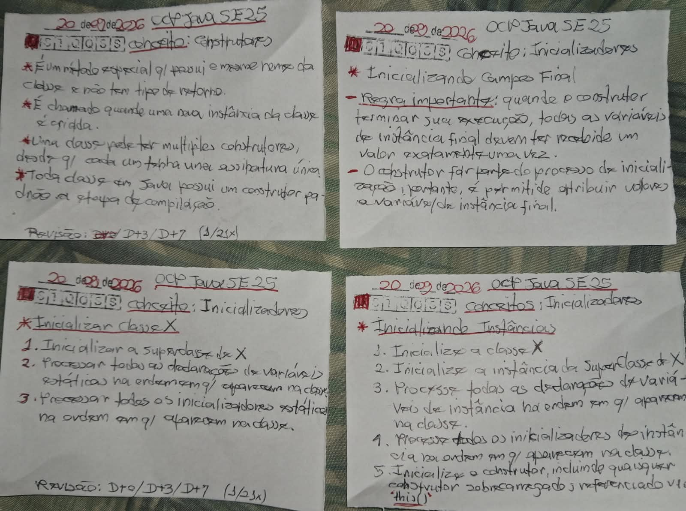

# Técnica Feynman 

Tendo em mente o vídeo [Como APRENDER QUALQUER COISA de maneira INTELIGENTE | A Técnica Feynman](https://youtu.be/CN_SCpGuJ_w?si=7eqvv5fpdCkjXVdz)! 

Aplicando o protocolo Feynman de 60 minutos especificamente para o CONCEITO: Construtores! E usar os áudios e cards para aplicar a [técnica revisão espaçada](https://youtu.be/XG0CAM_VYdE?si=-YqvN01n5A44NIGC).


## Escolha o Assunto (0-2 min)

CONCEITO: Construtores

Base referêncial Livro: [OCP Oracle Certified Professional Java SE 21 Developer: Study Guide Exam 1Z0-830](https://a.co/d/0alQOByp).

```
OCP Oracle Certified Professional Java SE 21 Developer
» Capítulo 6 ■ Projeto de Classes
» » Criando Classes
» » » Declarando Construtores
» » » Criando um Construtor
```

## Escrever à Mão (2-25 min)

Numa folha de papel (card), escreva: 


```
O que é?
Como funciona?
Por que funciona?
Quando usar?
Quando NÃO usar?
Qual pegadinha?

```

### Evidências

E tire uma foto de evidência e coloque na pasta: `/home/pssilva/projetos/oracle-certifications/ocp-javase25-developer/01-class-design/docs/feynman/construtores/evidencias`




## Explique em voz alta (25-40 min)

Explique sem condultas como se estivesse ensinando para um desenvolvedor Jr.


## Grave Áudio (40-50 min)

Gravar o áudio auto explicativo sem consultas, assim acionando, ativando e consolidando a rede do conhecimento.

O áudio pode começar com alguma coisa assim:

> "Hoje vou explicar como se eu estivesse ensinando um desenvolvedor Java júnior..."

Isso força você a abandonar o reconhecimento passivo e fazer recuperação ativa.

IMPORTANTE: Tendo em mente o vídeo: [Você Aprendeu Idiomas do Jeito Errado a Vida Toda — Richard Feynman Explica](https://youtu.be/7iFNXjXLY7Y?si=b9M_xaJjytUxnRKy), assim que possível, gravar áudios em inglês também para praticar as habilidades de escrita e fala! Assim, buscando recondicionar o cérebro para se adaptar e entender inglês! 

## Verificar (50-60 min)

Fazer a revisão de correções do material, do roteiro do áudio! 
Buscando complementando com mais detalhes ou deixar a explicação o mais simples possível para qualquer criança de 5 anos possa entender!


## Código :: Pratique 

Pratique com código e responda questões da prova de certificação

NOTA: 

```java

// Coloque o código aqui!!

```

Procure responder o seguinte:

```

Respondeu no mínimo 10 questões do simulador do exame?
Quais são as pegadinhas mais comuns no exame?

```
